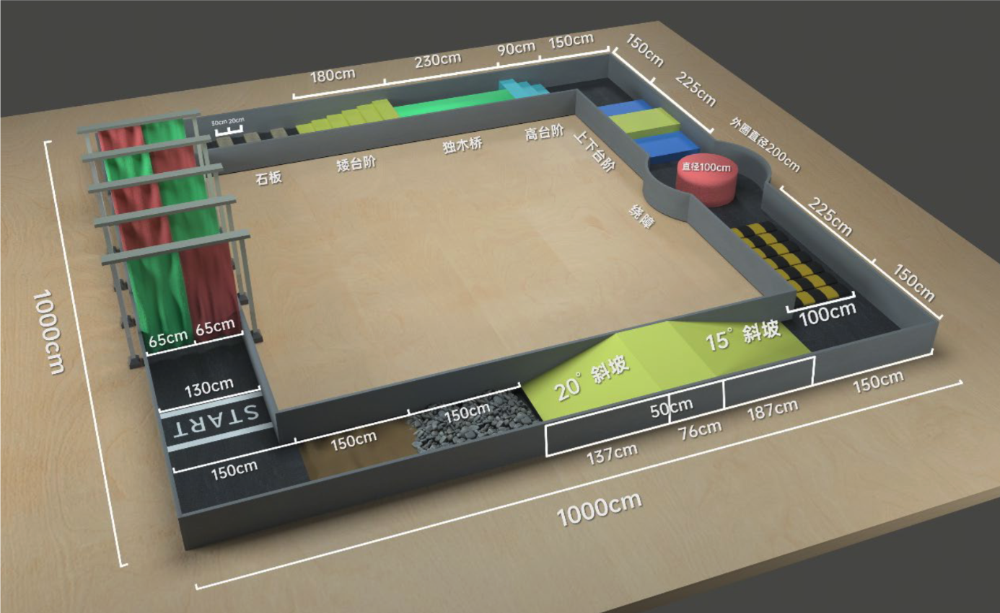
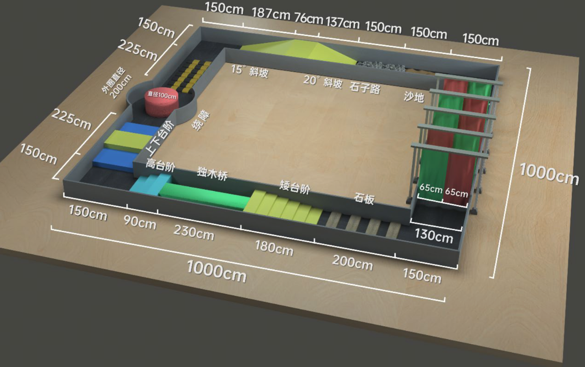

# 开发说明
### 相关开发文档
- ROS2及系统相关源码：https://github.com/MiRoboticsLab/cyberdog_ws
- 相关开发文档：https://github.com/MiRoboticsLab/blogs
- 相关开发示例：https://github.com/baizhongxing/Cyberdog_demo

### 更新运控
- 更新代码包
1. 拷贝 cyberdog_locomotion.tar 到NX上
2. tar -xvf *.tar

- 更新运控
cd  cyberdog_locomotion/cyberdog_locomotion-master/scripts
sudo ./scp_to_cyberdog.sh

### 步态更新
- 运控更新步态
说明： 真实沙盘要使用真实世界通关代码（zzl）高台.toml 和 楼梯.toml， 只不过原始代码中这俩文件名字写反了.

- 在NX上拷贝步态文件到运控板(可以变更顺序，本身toml文件内容写反了)
```bash
scp ./楼梯.toml root@192.168.44.233:/robot/robot-software/control/motion_list/cyberdog2/preinstalled/zzl_gaotai.toml
scp ./高台.toml root@192.168.44.233:/robot/robot-software/control/motion_list/cyberdog2/preinstalled/zzl_louti.toml
```

- 进入运控板
```bash
ssh root@192.168.44.233
cd /robot/robot-software/control/motion_list/cyberdog2/preinstalled/
cat zzl_gaotai.toml > cyberdog2_hiFive_LFleg_posCtrl.toml
cat zzl_louti.toml > cyberdog2_hiFive_RFleg_posCtrl.toml
```
# 知识点
### 腿式里程计
起始位置是0,0,0,0,0,0，即x=y=z=roll=pitch=yaw=0。
- [0]正数：向前走
- [1]正数：向左转
- [0]负数：向后走
- [1]正数：向右转

# 标准场地


